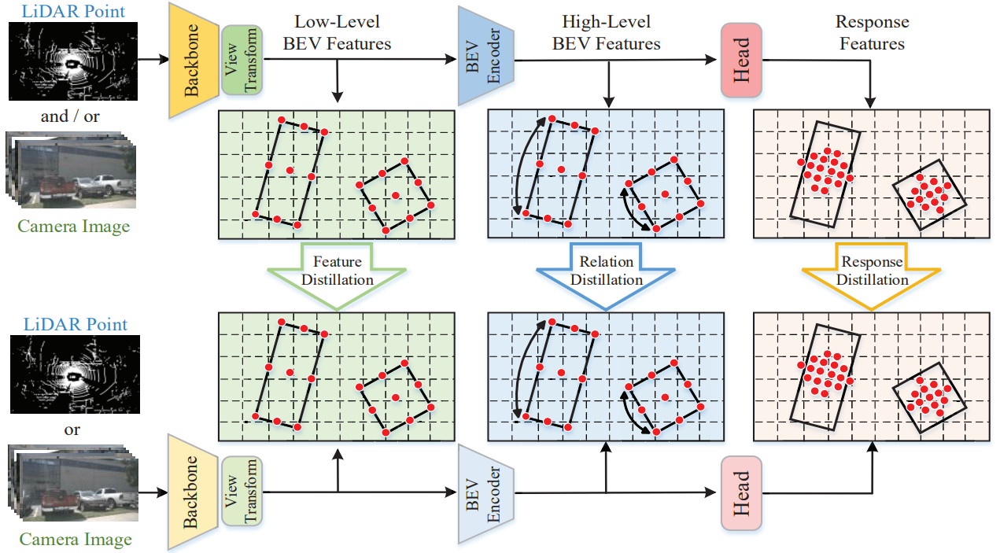

# UniDistill: A Universal Cross-Modality Knowledge Distillation Framework for 3D Object Detection in Bird's-Eye View

This is the official implementation of ***[UniDistill](https://arxiv.org/abs/2303.15083)*** **(CVPR2023 highlight✨, 10% of accepted papers)**. UniDistill offers a universal cross-modality knowledge distillation framework for different teacher and student modality combinations. The core idea is aligning the intermediate BEV features and response features that are produced by all BEV detectors.
<center>

</center>

[![[CVPR 2023 Highlight] UniDistill Presentation Video](https://res.cloudinary.com/marcomontalbano/image/upload/v1685171158/video_to_markdown/images/youtube--_DW32YG7SSE-c05b58ac6eb4c4700831b2b3070cd403.jpg)](https://www.youtube.com/watch?v=_DW32YG7SSE "[CVPR 2023 Highlight] UniDistill Presentation Video")

## Getting Started
### Installation
**Step 0.** Install python3.6 + CUDAv10.2 + CUDNNv8.0.4 + [pytorch](https://pytorch.org/)(v1.9.0).

**Step 1.** Install [MMCV-full==1.4.2](https://download.openmmlab.com/mmcv/dist/cu102/torch1.9.0/index.html), MMDetection2D==2.20.2, [MMDetection3D==0.18.0](https://github.com/open-mmlab/mmdetection3d) (Optional: download from [mmdet3d whl](https://drive.google.com/file/d/1y6AjikFQGc400dTim9IIFdvR8RNvnPId/view?)) (Note: need install with CUDA).
```bash
pip3 install mmcv-full==1.4.2 -f https://download.openmmlab.com/mmcv/dist/cu102/torch1.9.0/index.html
pip3 install mmdet==2.20.0
# download mmdet3d whl from https://drive.google.com/file/d/1y6AjikFQGc400dTim9IIFdvR8RNvnPId/view?usp=share_link
pip3 install mmdet3d-0.18.0-cp36-cp36m-linux_x86_64.whl
```
**Step 2.** Install requirements.
```shell
pip install -r requirements.txt
```
**Step 3.** Install UniDistill(gpu required).
```shell
python setup.py develop
```

### Data preparation
**Step 0.** Download nuScenes official dataset.

**Step 1.** Create a folder `/data/dataset/` and put the dataset in it.

The directory will be as follows.
```
├── data
│   ├── dataset
│   │   ├── maps
│   │   ├── samples
│   │   ├── sweeps
│   │   ├── v1.0-test
|   |   ├── v1.0-trainval
```
**Step 2.** Download the [infos](https://drive.google.com/file/d/1RIjSXRcQpwagkdIapE85awo2pXwCUj0e/view?usp=sharing) and put them in `/data/dataset/`
The directory will be as follows.
```
├── data
│   ├── dataset
│   │   ├── maps
│   │   ├── samples
│   │   ├── sweeps
│   │   ├── v1.0-test
|   |   ├── v1.0-trainval
|   |   ├── nuscenes_test_meta.pkl
|   |   ├── nuscenes_v1.0-trainval_meta.pkl
|   |   ├── test_info.pkl
|   |   ├── train_info.pkl
|   |   ├── val_info.pkl
```

### Testing
**Step 0.** Download the [checkpoint models](https://drive.google.com/file/d/1qOydSalaB4Zdtsb8HPSZt7btl3cKfdU2/view?usp=sharing)

**Step 1.**  Generate the result
If the modality of checkpoint is camera, run the following command:
```shell
python unidistill/exps/multisensor_fusion/nuscenes/BEVFusion/BEVFusion_nuscenes_centerhead_camera_exp.py -b 1 --gpus 1 -p  --ckpt_path <PATH_TO_CHECKPOINT>
```
If the modality of checkpoint is LiDAR, change the command as follow:
```shell
python unidistill/exps/multisensor_fusion/nuscenes/BEVFusion/BEVFusion_nuscenes_centerhead_lidar_exp.py -b 1 --gpus 1 -p  --ckpt_path <PATH_TO_CHECKPOINT>
```
**Step 2.**  Upload the result to the [evaluation server](https://eval.ai/web/challenges/challenge-page/356/)
The result named "nuscenes_results.json" is in the folder "nuscenes", which is in the parent folder of the tested checkpoint.
### Evaluation
**Step 0.** Download the checkpoint models as in "Testing"

**Step 1.**  Generate the result
If the modality of checkpoint is camera, run the following command:
```shell
python unidistill/exps/multisensor_fusion/nuscenes/BEVFusion/BEVFusion_nuscenes_centerhead_camera_exp.py -b 1 --gpus  1 -e  --ckpt_path <PATH_TO_CHECKPOINT>
```
If the modality of checkpoint is LiDAR, change the command as follow:
```shell
python unidistill/exps/multisensor_fusion/nuscenes/BEVFusion/BEVFusion_nuscenes_centerhead_camera_exp.py -b 1 --gpus 1 -e  --ckpt_path <PATH_TO_CHECKPOINT>
```
### Training
**Step 0.** Train the teacher
Training of the detector of one <MODALITY>:
```shell
python unidistill/exps/multisensor_fusion/nuscenes/BEVFusion/BEVFusion_nuscenes_centerhead_<MODALITY>_exp.py -b 1 --gpus 1 --max_epochs 20
```
**Step 1.**  Train the student
Put the checkpoint of the teachers to `unidistill/exps/multisensor_fusion/BEVFusion/tmp/`. Train the teacher of <MODALITY_1> and student of <MODALITY_2>
```shell
python unidistill/exps/multisensor_fusion/nuscenes/BEVFusion/BEVFusion_nuscenes_centerhead_<MODALITY_2>_exp_distill_<MODALITY_1>.py -b 1 --gpus 1 --max_epochs 20
```

## Acknowledgements
Thanks to Feiyang Tan, Nan Song, Jianjian Sun and Haotian Yao from Megvii Technology for their support in basic training infrastructure.


## Citation
If you find this project useful in your research, please consider citing:

```
@inproceedings{zhou2023unidistill,
  title={UniDistill: A Universal Cross-Modality Knowledge Distillation Framework for 3D Object Detection in Bird’s-Eye View},
  author={Shengchao Zhou and Weizhou Liu and Chen Hu and Shuchang Zhou and Chao Ma},
  booktitle={Proceedings of the IEEE/CVF Conference on Computer Vision and Pattern Recognition},
  year={2023}
}
```
